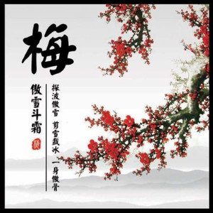

<html>
<head>
<meta charset="utf-8">
<meta http-equiv="X-UA-Compatible" content="IE=edge">
<meta name="viewport" content="width=device-width, initial-scale=1">
<title>花魂</title>
<link href="./css/style.css" rel="stylesheet" type="text/css">
<!--<link href="./css/multiColumnTemplate.css" rel="stylesheet" type="text/css">
<!-- HTML5 shim and Respond.js for IE8 support of HTML5 elements and media queries -->
<!-- WARNING: Respond.js doesn't work if you view the page via file:// -->
<!--[if lt IE 9]>
      
      
    <![endif]-->
</head>
<body>

  <header>
	  

    
 
      <h1 class="title">雪 国</h1>
    

	  

    <nav class="secondary_header" id="menu">
      <ul>
        <li><a href="https://www.baidu.com">梅花</a></li>
        <li><a href="#lan">兰花</a></li>
        <li><a href="https://www.baidu.com">菊花</a></li>
        <li><a href="https://www.baidu.com">竹子</a></li>
        <li><a href="https://www.baidu.com">莲花</a></li>
        <li><a href="https://www.baidu.com">海棠</a></li>
      </ul>
    </nav>
	  

  </header>
  
  <section>
    <h2 class="noDisplay">Main Content</h2>
    <article class="left_article">
      <h3>梅花</h3>
	  
墙角数枝梅,凌寒独自开. 遥知不是雪,为有暗香来.

      
《梅花》是北宋诗人王安石创作的一首五言绝句。此诗前两句写墙角梅花不惧严寒，傲然独放；后两句写梅花的幽香，以梅拟人，凌寒独开，喻典品格高贵，暗香沁人，象征其才气谯溢。

      
亦是以梅花的坚强和高洁品格喻示那些像诗人一样，处于艰难环境中依然能坚持操守、主张正义的人。全诗语言朴素，写得则非常平实内敛，却自有深致，耐人寻味。
    
    </article>
    

  </section>
  
    <section>
    <h2 class="noDisplay">Main Content</h2>
	<aside class="left_article"></aside>
    <article class="left_article">
	
      <h3>竹石</h3>
      
咬定青山不放松，立根原在破岩中。 千磨万击还坚劲，任尔东西南北风。

      
诗人所赞颂的并非竹的柔美，而是竹的刚毅。前两句赞美立根于破岩中的劲竹的内在精神。开头一个“咬”字，一字千钧，极为有力，而且形象化，充分表达了劲竹的刚毅性格。再以“不放松”来补足“咬”字，劲竹的个性特征表露无遗。

	  
次句中的“破岩”更衬托出劲竹生命力的顽强。后二句再进一层写恶劣的客观环境对劲竹的磨练与考验。不管风吹雨打，任凭霜寒雪冻，苍翠的青竹仍然“坚劲”，
	  傲然挺立。“千磨万击”、“东南西北风”，极言考验之严酷。这首诗借物喻人，作者通过咏颂立根破岩中的劲竹，含蓄地表达了自己绝不随波逐流的高尚的思想情操。全诗语言质朴，寓意深刻。

    </article>
    
  </section>
  
  
  <section>
    <h2 class="noDisplay">Main Content</h2>
    <article class="left_article">
      <h3>菊花</h3>
	  
结庐在人境，而无车马喧。 
		问君何能尔？心远地自偏。 
		采菊东篱下，悠然见南山。 
		山气日夕佳，飞鸟相与还。 
		此中有真意，欲辨已忘言。

      
“采菊东篱下，悠然见南山”二句，历来被评为“静穆”、“淡远”，得到很高的称誉。然而简单地以这种美学境界来概括陶渊明的全部创作，又是偏颇的

      
居住在人世间，却没有车马的喧嚣。问我为何能如此，只要心志高远，自然就会觉得所处地方僻静了。在东篱之下采摘菊花，悠然间，那远处的南山映入眼帘。山中的气息与傍晚的景色十分好，有飞鸟，结着伴儿归来。这里面蕴含着人生的真正意义，想要辨识，却不知怎样表达。
    
    </article>
    

  </section>
 
  

    

      
  

      <h4>梅</h4>
      
腊冬

    

	
    

		
      
  

      <h4>兰</h4>
      
立夏

    

	
    

      
  

      <h4>菊</h4>
      
霜秋

    

	
    

      
  

      <h4>竹</h4>
      
正春

    

	

  

  

    

      <h2 class="column_title">业精于勤荒于嬉</h2>
	  
    

    

      <h2 class="column_title">行成于思毁于随</h2>
    

  

  

    

    

    

    

  

  

<iframe width="100%" src="./test.html" scrolling="no"></iframe>
</body>
</html>
